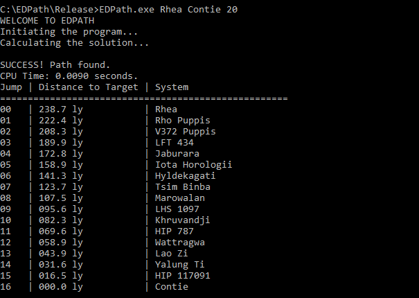

# EDPath

EDPath implements routing algorithm for video game Elite: Dangerous. It computes the optimal route between star systems inside the Bubble. To use it, you need to download the Release/EDPath.exe and Release/stardata.txt files to one folder.

```shell
EDPath.exe <START> <TARGET> <JUMPRANGE>

```
Use underscores instead of spaces in star names.



