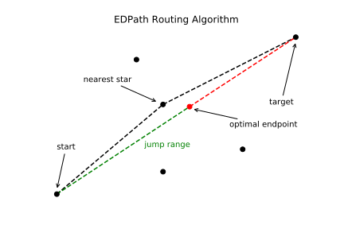

# EDPath

EDPath implements a routing algorithm for video game Elite: Dangerous. It computes the optimal route
between star systems. To use it, you need to download the Release/EDPath.exe and Release/stardata.txt
files to one folder.

```text
cmd /k EDPath.exe <START> <TARGET> <JUMPRANGE>
```

Use underscores instead of spaces in star names. Example output for `cmd /k EDPath.exe Rhea Contie 20`
is below.

```text
WELCOME TO EDPATH
Initiating the program...
Calculating the solution...

SUCCESS! Path found.
CPU Time: 0.0030 seconds.
Jump | Distance to Target | System
====================================================
00   | 238.7 ly           | Rhea
01   | 222.4 ly           | Rho Puppis
02   | 208.3 ly           | V372 Puppis
03   | 189.9 ly           | LFT 434
04   | 172.8 ly           | Jaburara
05   | 158.9 ly           | Iota Horologii
06   | 141.3 ly           | Hyldekagati
07   | 123.7 ly           | Tsim Binba
08   | 107.5 ly           | Marowalan
09   | 095.6 ly           | LHS 1097
10   | 082.3 ly           | Khruvandji
11   | 069.6 ly           | HIP 787
12   | 058.9 ly           | Wattragwa
13   | 043.9 ly           | Lao Zi
14   | 031.6 ly           | Yalung Ti
15   | 016.5 ly           | HIP 117091
16   | 000.0 ly           | Contie
```


